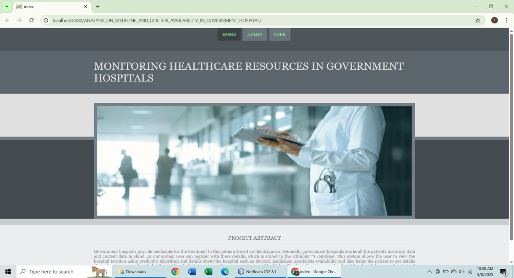
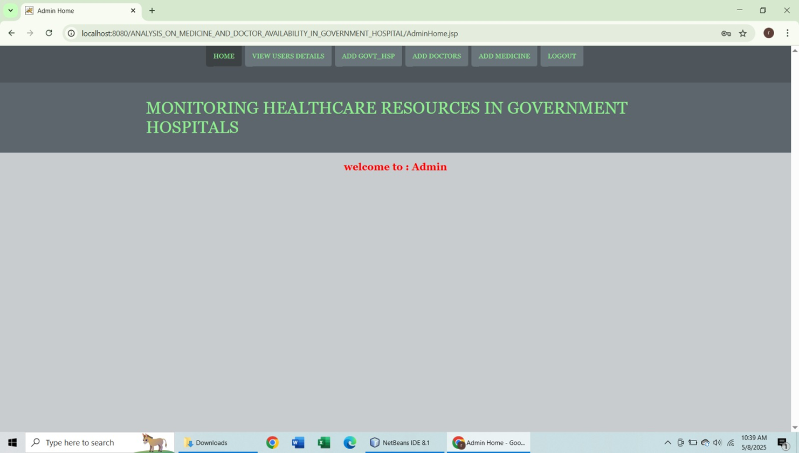
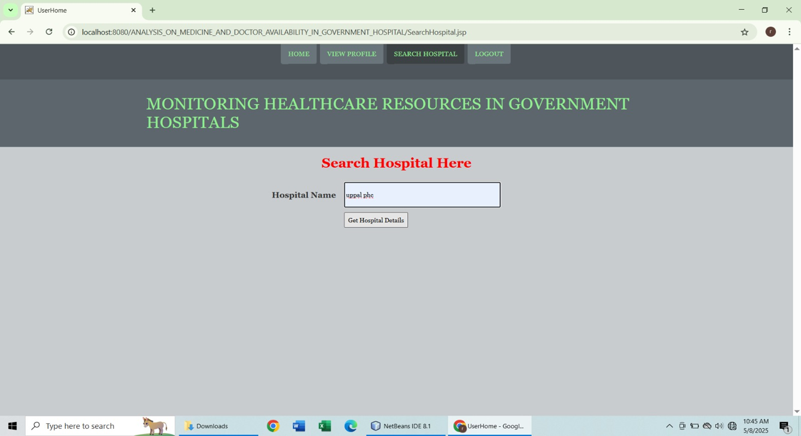
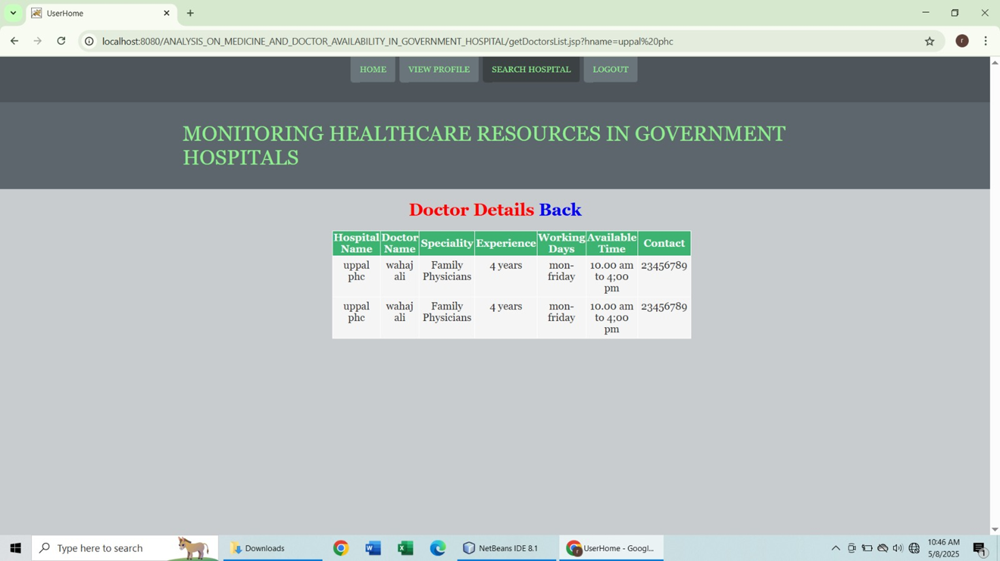
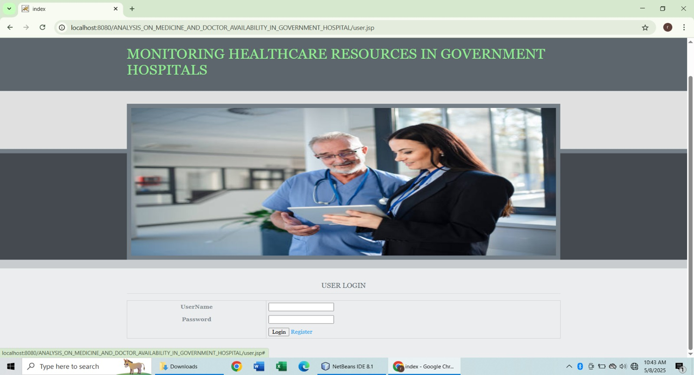

Monitoring Healthcare Resources in Government Hospitals
A web-based application designed to centralize and streamline healthcare resource data across government hospitals. This project improves public access to accurate, real-time information on hospitals, doctors, treatments, and medicine availability.
---

Features
Centralized database for hospitals, doctors, and medicines

Real-time updates on availability and schedules

Admin panel for secure data management

User-friendly interface for public access

Search and filter functionality for quick navigation

---

Modules
Admin Module
Add/update hospital details

Manage doctor profiles

Maintain medicine inventory

User Module
Search hospitals by location/specialty

View doctor availability

Check medicine stock

---

Tech Stack
Layer	Technology Used
Frontend	HTML5, CSS3, JavaScript
Backend	Java (Java 8.1)
Database	MySQL
Web Server	Apache Tomcat
Modeling Tools	Rational Rose

---
Screenshots

